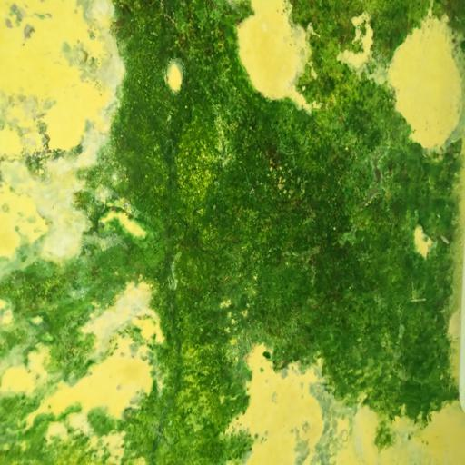
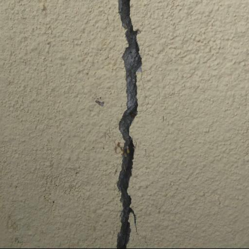
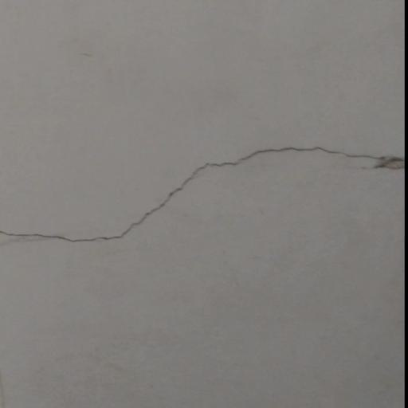
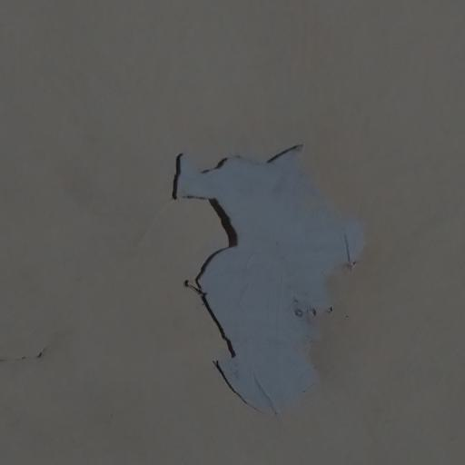
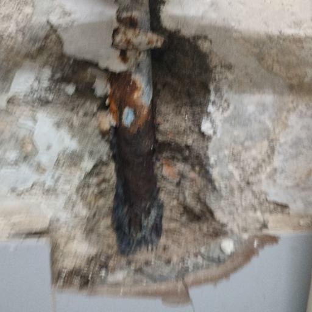
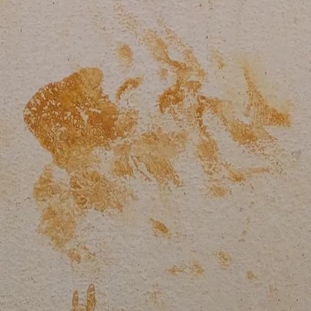

# BD3- Building Defect Detetcion Dataset

## Dataset
Dataset is now available on kaggle.!

Download the [BD3-Dataset](https://indianinstituteofscience-my.sharepoint.com/:f:/g/personal/praveenkotta_iisc_ac_in/Et7Ki_ILnGtBi1oFpOioPGcBp4zzUodaYsJ5UV3tve1Geg?e=3zxutQ).

The released dataset comes in two versions: the original captured and preprocessed dataset consisting of 3,965 raw samples, and an augmented version derived from the original data. All image samples have a resolution of 512x512. The entire data collection and annotation process required approximately 200 man-hours.

## Dataset folder structure
    .
    ├── ...
    ├── train                   # train folder
    │   ├── cls00              
    │   ├──   ├── cls00_001.jpg               
    │   ├──   :                 
    │   └── cls06              
    └── val                     # validation folder
    └── test                    # test folder
## Example Image Samples

  
  
  

  
  
  

## Dataset Detailes

The defect classes were carefully selected to improve structural management of buildings. Below are the definitions of the defect classes and the number of image samples for each class:

* Algae [624]: Fungi resembling green, brown, or black patches or slime on the surface.
* Major Crack [620]: Cracks with visible gaps.
* Minor Crack [580]: Cracks with no visible gaps.
* Peeling [520]: Loss of the outer covering of paint.
* Spalling [500]: Surface break exposing inner material.
* Stain [521]: Visible man-made or natural color marks.
* Normal [600]: Clean walls with no visible signs of the above defects.
  
To improve generalization by providing a broader range of examples, various augmentation techniques were applied to the original dataset of 3,965 images. This process generated 2,000 variants for each of the seven classes, resulting in a total of 14,000 augmented samples. The augmentation involved geometric transformations such as rotations, vertical and horizontal flips, as well as color space adjustments like modifying brightness, contrast, saturation, and hue.
## Preprocessing and Model Training

The codebase folder [code](https://github.com/Praveenkottari/BD3-Dataset/tree/main/code) contains all the files and notebooks used for the experiments.

[data-augment-technq](https://github.com/Praveenkottari/BD3-Dataset/tree/main/code/data-augment-Technq): This subfolder provides a notebook that applies several augmentation techniques to generate additional data samples.

[data-process](https://github.com/Praveenkottari/BD3-Dataset/tree/main/code/data-process): This folder contains Python scripts for renaming, resizing, and other preprocessing activities.

[train-test-split](https://github.com/Praveenkottari/BD3-Dataset/tree/main/code/train-test-split) : This folder includes a Python script for splitting the dataset into training and testing sets based on a custom ratio.

[model-train](https://github.com/Praveenkottari/BD3-Dataset/tree/main/code/model-train): This folder is a collection of all the notebooks used for model training in this study. Each model has its own separate notebook.

The notebooks and Python scripts mentioned above can be reused by cloning this repository to your local machine. You can also download the notebooks, make necessary changes to datasets, file paths, or other configurations, and use them for training and testing.

## Deep Learnign models

| 	model	 | 	architecture	 | 	document	 | 
| 	:-----:	 | 	:-----:	 | 	:-----:	 | 
| 	ViT16	| 	Transformer	| 	[paper](https://arxiv.org/abs/2010.11929)	 | 
| 	VGG16 	| 	CNN	| 	[paper](https://arxiv.org/abs/1409.1556)	 | 
| 	ResNet18	| 	CNN	| 	[paper](https://arxiv.org/abs/1512.03385)	 | 
| 	Alexnet	| 	CNN	| 	[paper](https://proceedings.neurips.cc/paper_files/paper/2012/file/c399862d3b9d6b76c8436e924a68c45b-Paper.pdf)	 | 
| 	MobileNet-V2	| 	CNN	| 	[paper](MobileNet-V2)	 | 

