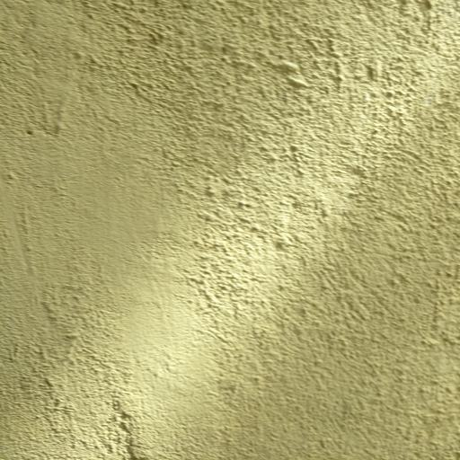

# BD3: Building Defects Detection Dataset

Download the [BD3-Dataset](https://indianinstituteofscience-my.sharepoint.com/:f:/g/personal/praveenkotta_iisc_ac_in/Et7Ki_ILnGtBi1oFpOioPGcBp4zzUodaYsJ5UV3tve1Geg?e=3zxutQ).

The inspection of urban built environments is critical to maintaining structural integrity and safety. However, traditional manual inspection methods are often time-consuming, labor-intensive, prone to human error, and difficult to scale across large urban environments. These limitations become particularly evident in fast-growing cities, where aging infrastructure and the demand for regular inspection outpace the capacity of human inspectors. To overcome these challenges, the use of automated building inspection techniques powered by computer vision has gained significant interest. By employing technologies such as drones and multi-robot systems, these techniques promise to make building inspections faster, more accurate, and scalable. Despite these advances, a major barrier to the development and deployment of robust automated inspection systems is the lack of comprehensive and publicly available datasets. Most existing datasets fail to capture a wide range of structural defects or do not provide enough diversity in image samples, limiting the ability of machine learning models to generalize across different environments and defect types.

To address this gap, we present **BD3: Building Defects Detection Dataset**, specifically designed to evaluate and develop computer vision techniques for automated building inspections. 
BD3 consists of two subsets: 

- **Original dataset**: 3,965 RGB images annotated to cover six common structural defects, along with normal wall images.
- **Augmented dataset**: 14,000 images created using geometric transformations (rotations, flips) and color adjustments (brightness, contrast, saturation, and hue). This augmentation datset is intended to enhance the dataset's diversity, improving the robustness and generalizability of models trained on BD3.

By making BD3 publicly available, we aim to accelerate the development of reliable and scalable automated inspection systems that can help ensure the safety and longevity of our urban infrastructure.

## Building Defects Details

The BD3 dataset contains six defect classes and normal wall images. Below are the descriptions of these defect classes along with the number of image samples available for each:

| Defect Name  | Description                                                                    | Number of Images |
|--------------|--------------------------------------------------------------------------------|-----------------:|
| **Algae**    | Fungi resembling green, brown, or black patches or slime on the surface        | 624              |
| **Major Crack** | Cracks with visible gaps                                                    | 620              |
| **Minor Crack** | Cracks without visible gaps                                                 | 580              |
| **Peeling**  | Loss of the outer covering of paint                                            | 520              |
| **Spalling** | Surface break exposing inner material                                          | 500              |
| **Stain**    | Visible man-made or natural color marks                                        | 521              |
| **Normal**   | Clean walls with no visible signs of defects                                   | 600              |

## Sample Images

<table border="0" style="text-align: center;">
  <tr>
    <td style="text-align: center;"> <b>(a) Algae</b></td>
    <td style="text-align: center;"> <b>(b) Major Crack</b></td>
    <td style="text-align: center;"> <b>(c) Minor Crack</b></td>
    <td style="text-align: center;"> <b>(d) Peeling</b></td>
  </tr>
  <tr>
    <td style="text-align: center;"> <b>(e) Spalling</b></td>
    <td style="text-align: center;"> <b>(f) Stain</b></td>
    <td style="text-align: center;"> <b>(g) Normal</b></td>
  </tr>
</table>

## Benchmarking

To assess the utility and practical usefulness of the BD3 dataset, we benchmarked five deep learning-based image classifiers: Vision Transformers (ViT), VGG16, ResNet18, AlexNet, and MobileNetV2. These models are implemented using pre-trained [`torchvision.models`](https://pytorch.org/vision/stable/models.html). The training, validation and test splits are: 60%, 20% and 20%.

<table border="1" cellspacing="0" cellpadding="5">  
  <caption><b>Comparison of model performance on the original and augmented datasets.</b></caption>  
  <thead>
    <tr>
      <th rowspan="2">Model</th>
      <th colspan="3">Original dataset</th>
      <th colspan="3">Augmented dataset</th>
    </tr>
    <tr>
      <th>Precision</th>
      <th>Recall</th>
      <th>F1-score</th>
      <th>Precision</th>
      <th>Recall</th>
      <th>F1-score</th>
    </tr>
  </thead>
  <tbody>
    <tr>
      <td><a href='https://pytorch.org/vision/stable/models/resnext.html'>ResNet18</a></td>
      <td>0.8320</td>
      <td>0.8308</td>
      <td>0.8301</td>
      <td>0.9915</td>
      <td>0.9516</td>
      <td>0.9711</td>
    </tr>
    <tr>
      <td>VGG16</td>
      <td>0.8409</td>
      <td>0.8359</td>
      <td>0.8363</td>
      <td>0.9066</td>
      <td>0.9057</td>
      <td>0.9056</td>
    </tr>
    <tr>
      <td>MobileNetV2</td>
      <td>0.8479</td>
      <td>0.8422</td>
      <td>0.8419</td>
      <td>0.8756</td>
      <td>0.8750</td>
      <td>0.8746</td>
    </tr>
    <tr>
      <td>AlexNet</td>
      <td>0.8842</td>
      <td>0.8801</td>
      <td>0.8803</td>
      <td>0.9399</td>
      <td>0.9389</td>
      <td>0.9391</td>
    </tr>
    <tr>
      <td>ViTpatch16</td>
      <td><b>0.9342</b></td>
      <td><b>0.9318</b></td>
      <td><b>0.9323</b></td>
      <td><b>0.9880</b></td>
      <td><b>0.9879</b></td>
      <td><b>0.9879</b></td>
    </tr>
  </tbody>
</table>

<table border="1" cellspacing="0" cellpadding="5">
  <caption><b>Class-wise comparison of the ViT model's performance on the original and augmented datasets.<b></caption>
  <thead>
    <tr>
      <th rowspan="2">Class</th>
      <th colspan="3">Original dataset</th>
      <th colspan="3">Augmented dataset</th>
    </tr>
    <tr>
      <th>Precision</th>
      <th>Recall</th>
      <th>F1-score</th>
      <th>Precision</th>
      <th>Recall</th>
      <th>F1-score</th>
    </tr>
  </thead>
  <tbody>
    <tr>
      <td>Algae</td>
      <td>0.9915</td>
      <td>0.9516</td>
      <td><b>0.9711</b></td>
      <td>1.0000</td>
      <td>0.9975</td>
      <td><b>0.9987</b></td>
    </tr>
    <tr>
      <td>Major crack</td>
      <td>0.8761</td>
      <td>0.8534</td>
      <td><u>0.8646</u></td>
      <td>0.9794</td>
      <td>0.9550</td>
      <td><u>0.9670</u></td>
    </tr>
    <tr>
      <td>Minor crack</td>
      <td>0.8417</td>
      <td>0.9435</td>
      <td>0.8897</td>
      <td>0.9612</td>
      <td>0.9925</td>
      <td>0.9766</td>
    </tr>
    <tr>
      <td>Peeling</td>
      <td>0.9595</td>
      <td>0.9134</td>
      <td>0.9359</td>
      <td>0.9851</td>
      <td>0.9925</td>
      <td>0.9887</td>
    </tr>
    <tr>
      <td>Stain</td>
      <td>0.9166</td>
      <td>0.9519</td>
      <td>0.9339</td>
      <td>0.9950</td>
      <td>0.9975</td>
      <td><b>0.9962</b></td>
    </tr>
    <tr>
      <td>Normal</td>
      <td>1.0000</td>
      <td>0.9916</td>
      <td><b>0.9958</b></td>
      <td>0.9974</td>
      <td>0.9925</td>
      <td>0.9949</td>
    </tr>
  </tbody>
</table>

## Confusion matrix

# Code

- **[Data Pre-processing](code/data-process)** - This folder contains Python scripts for renaming images, resizing, and other preprocessing functions. 
- **[Image Augmentation](code/data-augment-Technq)** -Python code for generating augmented dataset.
- **[Dataset Splitting](code/train-test-split)** - Python code for splitting the dataset into training, validation, and test sets.
- **[Model Training and Evaluation](code/model-train)** - Scripts for training and evaluation of different deep learning models.
- **[Result Analysis](code/results)** - Python scripts to analyze and visualize the results.

## Directure structure
    .
    ├── code                         # All Python codes
    │   ├── data-process             # Data pre-processing code
    │   ├── data-augment-Technq      # Image augmentation code
    │   ├── train-test-split         # Data split code
    │   ├── model-train              # Model training and evaluation code
    │   └── Results                  # Results analysis
    └── example-imgs                 # Dataset files
        ├── ...

## Citation
TODO...

## Deep Learnign models

| 	model	 | 	architecture	 | 	document	 | 
| 	:-----:	 | 	:-----:	 | 	:-----:	 | 
| 	ViT16	| 	Transformer	| 	[paper](https://arxiv.org/abs/2010.11929)	 | 
| 	VGG16 	| 	CNN	| 	[paper](https://arxiv.org/abs/1409.1556)	 | 
| 	ResNet18	| 	CNN	| 	 | 
| 	Alexnet	| 	CNN	| 	[paper](https://proceedings.neurips.cc/paper_files/paper/2012/file/c399862d3b9d6b76c8436e924a68c45b-Paper.pdf)	 | 
| 	MobileNet-V2	| 	CNN	| 	[paper](MobileNet-V2)	 | 
